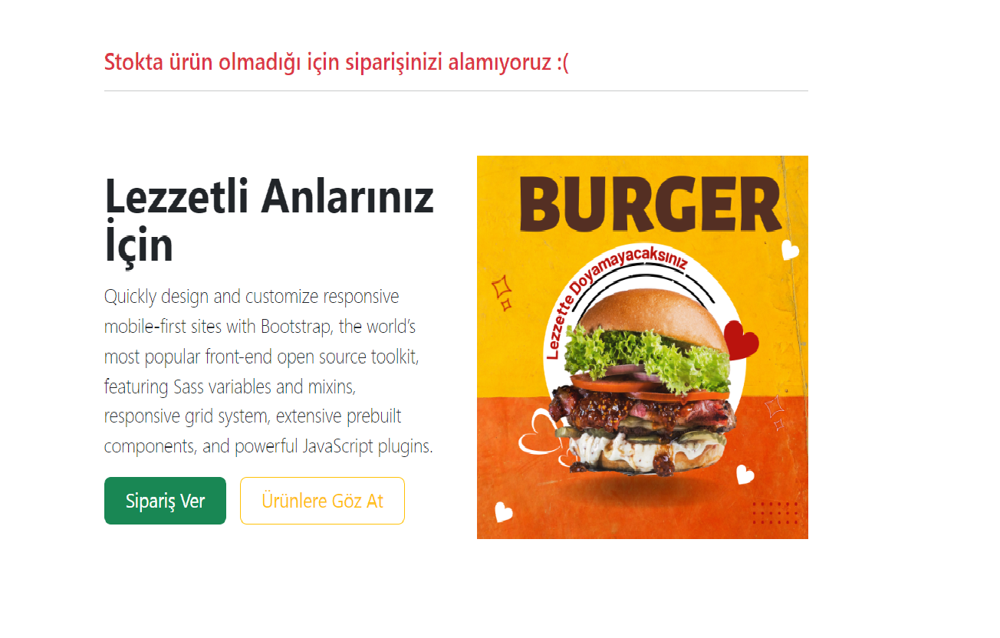
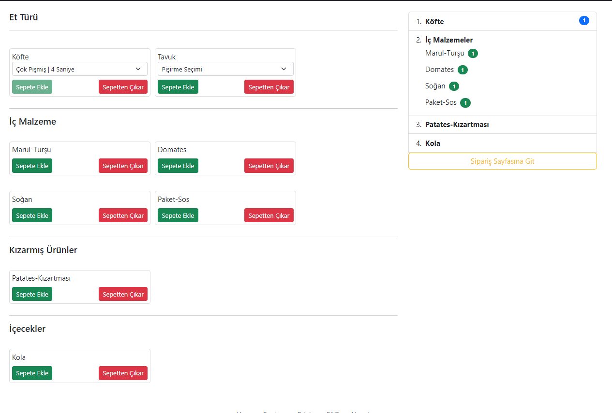
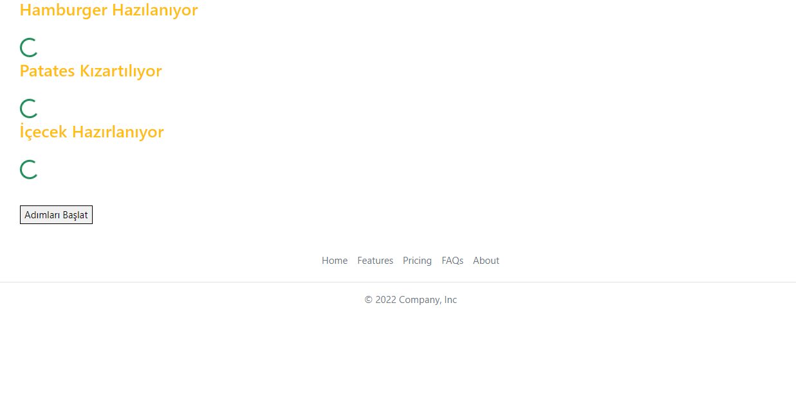
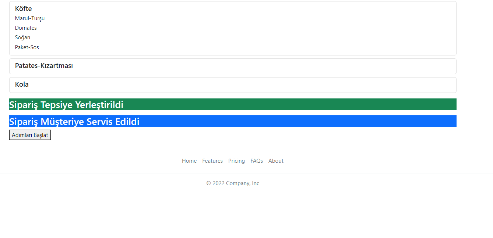

# HamburgerOrderApp

## Angular Hamburger Hazırlama Projesi

Malzeme Listesi:
Tüm malzemelerden 5’er adet olduğu varsayılacaktır.
- Marul Turşu
- Paket Sos
- Soğan
- Köfte
- Tavuk
- Domates
- Ekmek
- Patates
- Cola
İş Süreci:
1. Sipariş al (1 Saniye)
2. Her malzeme için stok kontrolü (3 saniye)
- Eğer stokta malzeme eksiği varsa uyarı mesajı verilmeli,
işlem iptal edilmeli, yeni istek alınmamalı)
3. Köfte mi? - Tavuk mu? sorgusu(1 saniye)
Köfte ise :
- Pişme derecesi kontrolü
- Az Pişmiş(2 saniye)
- Orta Pişmiş (3 saniye)
- Çok Pişmiş (4 saniye)
Tavuk ise:
- Tavuk Pişir (3 saniye)
- Hamburger Yapımı(2 saniye): Köfte veya Tavuk(1 adet), Marul(1
adet), Domates(1 adet), Turşu(1 adet), Soğan(1 adet)
hamburger ekmeğiyle birleştirilecek. Malzemeler siparişte varsa
eklenmeli!
4. Patatesleri Kızart (5 saniye)
5. İçeçeği Hazırla (2 saniye)
6. Sosları ve Ürünleri Servis Tepsisine Koy (1 saniye)
7. Müşteriye Servis Et (1 saniye)
Genel sistemin akış şeması: 1. step -> 2. step -> 3,4,5 -> 6 -> 7 3,4 ve
5. stepler aynı anda başlatılmalı. Birbirlerinin bitmesini beklememeli. 6.
step, 3,4 ve 5. stepler bittikten sonra başlamalı 7. step, 6. stepten sonra
başlayacak.
Verilen malzeme listesi ve iş sürecini kullanarak bir hamburger
işletmesi fonksiyonelitesi hazırlanmalıdır. Html, css ya da bootstrap
kullanarak görüntü katabilirsiniz
